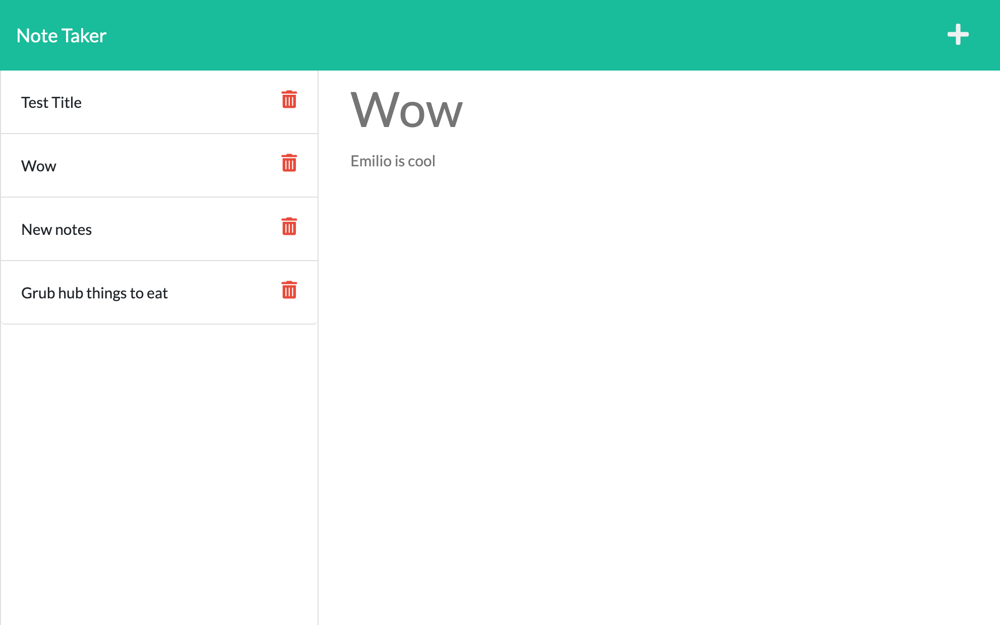

# Express.js_Note_Taker

## Description
This assignment already had a front end completed where you can create notes by writing and saving them. The work needed was to build and connect the back end and then deploy the application on Heroku.

## Table of Contents
- [Installation](#installation)
- [Usage](#usage)
- [Credits](#credits)
- [License](#license)
- [Tests](#tests)
- [Qustions](#questions)

## Installation
Install Node.js, Express.js, uuid, and path.

## Usage
Application is hosted on [Heroku](https://note-taker-rss.herokuapp.com/)

## Credits
Collaborators that helped with this project: Emilio Estevez

## License
This project is covered under an MIT license. More information can be found here: https://opensource.org/licenses/MIT

## Tests
No testing

## Questions
If you have any questions, feel free to email <mrronsit@gmail.com> or feel free to peruse my [Github](https://github.com/Sitmeister)!
